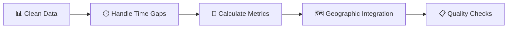

# 🚔 Crime Statistics in Berlin - Crime Atlas Integration

> **Integrating Berlin Police Crime Atlas data to enhance property listings with neighborhood safety insights**

[](https://daten.berlin.de/datensaetze/kriminalitatsatlas-berlin)
[](https://creativecommons.org/licenses/by-sa/4.0/)
[]()

## 📋 Overview

This directory contains data files and documentation for integrating **Berlin Crime Atlas** statistics into our database. The data layer provides comprehensive crime metrics to enrich property listings and neighborhood analysis with safety information.

## 🎯 Primary Data Source

### 🗺️ Berlin Crime Atlas (Kriminalitätsatlas Berlin)

| **Attribute** | **Details** |
|---------------|-------------|
| **File** | `crime_atlas/kriminalitaetsatlas_2014-2023.xlsx` |
| **Source** | Berlin Police Department (Polizei Berlin) |
| **Portal** | [Berlin Open Data Portal](https://daten.berlin.de/datensaetze/kriminalitatsatlas-berlin) |
| **Interactive Atlas** | [kriminalitaetsatlas.berlin.de](https://www.kriminalitaetsatlas.berlin.de/) |
| **License** | Creative Commons Attribution Share-Alike (CC-BY-SA) |
| **Update Frequency** | Biennial (every 2 years) |
| **Data Type** | Static (manual import) |

### 📊 Coverage Details

- **📅 Time Period**: 2014-2023 (biennial releases)
- **🗺️ Geographic Scope**: 
  - 12 Berlin districts (Bezirke)
  - 138 district regions (Bezirksregionen)

### 🔍 Crime Categories (17 Types)

| **German** | **English** | **Category** |
|------------|-------------|--------------|
| Straßenraub | Street Robbery | Violent Crime |
| Fahrraddiebstahl | Bicycle Theft | Property Crime |
| Wohnungseinbruch | Residential Burglary | Property Crime |
| Rauschgiftdelikte | Drug-related Crimes | Drug Crime |
| Sachbeschädigung | Property Damage | Property Crime |
| Körperverletzung | Assault | Violent Crime |
| Betrug | Fraud | Financial Crime |
| *+ 10 additional categories* | | |

### 📈 Data Metrics

- **📊 Absolute Cases** (Fallzahl) - Total reported incidents
- **📈 Frequency Rate** (Häufigkeitszahl) - Cases per 100,000 inhabitants  
- **👥 Population Base** (EinwohnerInnen) - Reference population for calculations
- **🆔 Geographic ID** (RAUMID) - LOR area identification codes

## 🔄 Transformation Pipeline

### 🛠️ Phase 1: Data Extraction & Cleaning


**Key Steps:**
- ✅ Extract data from XLSX sheets
- ✅ Translate German headers and crime types
- ✅ Validate numeric data (cases, frequencies)
- ✅ Map LOR area codes to geographic coordinates

### 🧮 Phase 2: Data Processing



**Key Steps:**
- ⏱️ **Temporal Processing**: Interpolate missing years (biennial → annual)
- 🔢 **Safety Metrics**: Generate composite safety scores
- 📍 **Geographic Mapping**: Link to existing neighborhood boundaries
- ✅ **Quality Assurance**: Validate against official statistics

### 🗄️ Phase 3: Database Integration

**Target Schema:**
```sql
crime_statistics (
    📋 id              SERIAL PRIMARY KEY,
    🆔 area_id         VARCHAR(20),      -- LOR identifier
    📍 area_name       VARCHAR(255),     -- Human-readable name  
    🏛️ bezirk_name     VARCHAR(100),     -- District name
    🚨 crime_type      VARCHAR(100),     -- English crime type
    🇩🇪 crime_type_de   VARCHAR(100),     -- German original
    📅 year            INTEGER,          -- Data year
    📊 absolute_cases  INTEGER,          -- Total cases
    📈 frequency_100k  FLOAT,           -- Rate per 100k
    👥 population_base INTEGER,          -- Reference population
    🗺️ coordinates     GEOMETRY,         -- Area centroid
    ✅ data_quality    VARCHAR(20)       -- Quality flag
)
```

## ⚠️ Data Quality Considerations

### 🚩 Known Limitations

| **Issue** | **Impact** | **Mitigation** |
|-----------|------------|----------------|
| ⏰ **Temporal Gaps** | Data only every 2 years | Interpolation algorithms |
| 🌍 **Language Dependency** | German source data | Comprehensive translation mapping |
| 🗺️ **Geographic Complexity** | LOR vs neighborhood boundaries | Multiple spatial datasets validation |
| 📊 **Reporting Variations** | Different crime type accuracies | Quality flags and metadata |

### ✅ Quality Assurance Strategy

- 🔍 Cross-reference with official Berlin statistics
- 🗺️ Validate geographic boundaries using multiple sources  
- 🏷️ Implement quality flags (verified/interpolated/estimated)
- 📝 Document all transformation decisions

## 📁 File Structure

```
sources/
├── 📖 README.md                              # This documentation
└── 🚔 crime_atlas/
    ├── 📊 kriminalitaetsatlas_2014-2023.xlsx # Raw crime atlas data
    ├── 📚 data_dictionary.md                 # Column definitions
    ├── 📋 metadata.json                      # Download metadata
    └── 📥 DOWNLOAD_INSTRUCTIONS.txt          # Manual download guide
```

## 🎯 Project Roadmap

### ✅ **Step 1: Data Modeling** (Current)
- [x] 📋 Document crime atlas data source
- [x] 🗄️ Design database schema  
- [x] 📝 Create transformation plan
- [ ] 🚀 Submit data modeling PR

### ⏳ **Step 2: Data Transformation**
- [ ] 📥 Download and extract XLSX data
- [ ] 🔄 Implement translation mappings
- [ ] 📍 Process geographic identifiers  
- [ ] 🧮 Generate safety scores
- [ ] ✅ Validate data quality

### ⏳ **Step 3: Database Population**  
- [ ] 🗄️ Create database tables and indexes
- [ ] 📊 Load transformed crime data
- [ ] 🔗 Link with existing neighborhood/listing tables
- [ ] 🔄 Implement update workflows

## 📞 Support & Resources

| **Resource** | **Link** |
|--------------|----------|
| 📚 **Official Documentation** | Berlin Police methodology notes |
| 🛠️ **Technical Support** | [Berlin Open Data Portal](https://daten.berlin.de) |
| 📊 **Data Updates** | Monitor biennial releases (spring) |
| 🗺️ **Geographic Reference** | [LOR Spatial Units Guide](https://lab.technologiestiftung-berlin.de/projects/spatial-units/en/) |

---

<div align="center">

**🕐 Last Updated**: June 2025  
**📊 Status**: Phase 1 (Research & Modeling) - Crime Atlas Only  
**🎯 Next Milestone**: Data transformation and processing scripts

[]()
[]()
[]()

</div>