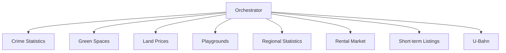

# Segmentation Module Architecture

## Overview
The segmentation system analyzes various urban metrics to categorize neighborhoods.

## Module Structure


## Key Components
1. **Data Loaders**: Fetch and preprocess data
2. **Feature Processors**: Calculate metrics
3. **Segmenters**: Apply rules/ML models
4. **SQL Queries**: Standardized data access
5. **Schemas**: Database documentation

## Usage
```python
from segmentation.orchestrator import SegmentationOrchestrator

orchestrator = SegmentationOrchestrator()
results = orchestrator.run_all_analyses(engine)
```

## Implementation Notes
- All modules follow same interface pattern
- Uses test_berlin_data schema
- Supports both rule-based and ML segmentation
- Includes comprehensive unit and integration tests
- All modules include SQL queries for data access