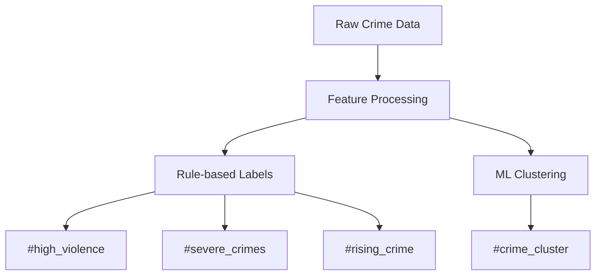

# Crime Statistics Segmentation Module

## 🚨 Safety Labels
### 🔍 Label Categories
- `#low_crime`: crime_rate < avg * 0.7
- `#high_violence`: violent_crimes > avg * 1.5  
- `#property_hotspot`: property_crimes > avg * 1.3
- `#crime_cluster`: DBSCAN-identified hot spots
- `#severe_crimes`: severity_weight > 4
- `#rising_crime`: yoy_change > 0.1
- `#safe_area`: crime_rate < avg * 0.5 AND violent_crimes < avg * 0.5

### ⚙️ Implementation
| Label | Rule | Type | Data Source |
|-------|------|------|-------------|
| #low_crime | crime_rate < city_avg * 0.7 | Dynamic | Police reports |
| #high_violence | violent_rate > city_avg * 1.5 | Dynamic | Crime stats |
| #crime_cluster | DBSCAN(eps=0.5, min_samples=5) | Dynamic | Spatial analysis |
| #severe_crimes | severity_weight > 4 | Dynamic | Crime reports |
| #rising_crime | yoy_change > 0.1 | Dynamic | Yearly comparisons |
| #safe_area | crime_rate < avg*0.5 AND violent_crimes < avg*0.5 | Dynamic | Combined metrics |

## 🛠 Implementation Details
### Data Processing
1. Pulls from `test_berlin_data.crimes`
2. Joins with neighborhood boundaries
3. 12-month rolling window
4. Normalizes by population
5. Calculates severity scores
6. Computes year-over-year changes

### Algorithms
- Spatial joins (PostGIS ST_Within)
- Crime rate normalization
- DBSCAN clustering (eps=0.5)
- Threshold-based segmentation
- Time series analysis



## 📊 Usage
```python
from crime_statistics import CrimeSegmenter
segmenter = CrimeSegmenter()
results = segmenter.analyze(engine)  # Returns labeled neighborhoods
```

## ⚠️ Edge Cases
- Flags areas with <80% data coverage
- Handles seasonal variations
- Excludes commercial zones
- Adjusts for population density
- Handles missing severity data