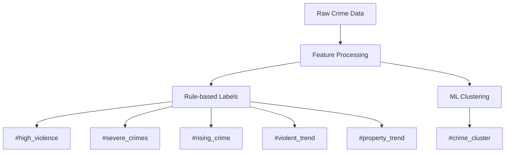

# Crime Statistics Segmentation Module

## 🚨 Safety Labels
### 🔍 Label Categories
- `#low_crime`: crime_rate < avg * 0.7 (per 100k population)
- `#high_violence`: violent_crimes > avg * 1.5 (per 100k population)
- `#property_hotspot`: property_crimes > avg * 1.3 (per 100k population)
- `#crime_cluster`: DBSCAN-identified hot spots (eps=0.5, min_samples=5)
- `#severe_crimes`: severity_weight > 4 (1-5 scale)
- `#rising_crime`: yoy_change > 0.1 (year-over-year change)
- `#safe_area`: crime_rate < avg * 0.5 AND violent_crimes < avg * 0.5
- `#violent_trend`: 3-month violent crime trend > 0.1
- `#property_trend`: 3-month property crime trend > 0.1

### ⚙️ Implementation
| Label | Rule | Type | Data Source |
|-------|------|------|-------------|
| #low_crime | crime_rate < city_avg * 0.7 | Dynamic | Police reports |
| #high_violence | violent_rate > city_avg * 1.5 | Dynamic | Crime stats |
| #property_hotspot | property_rate > city_avg * 1.3 | Dynamic | Crime stats |
| #crime_cluster | DBSCAN(eps=0.5, min_samples=5) | Dynamic | Spatial analysis |
| #severe_crimes | severity_weight > 4 | Static | Crime reports |
| #rising_crime | yoy_change > 0.1 | Dynamic | Yearly comparisons |
| #safe_area | crime_rate < avg*0.5 AND violent_crimes < avg*0.5 | Dynamic | Combined metrics |
| #violent_trend | 3-month trend > 0.1 | Dynamic | Time series |
| #property_trend | 3-month trend > 0.1 | Dynamic | Time series |

## 🛠 Implementation Details
### Data Processing
1. Pulls from `test_berlin_data.crimes` and `test_berlin_data.neighborhoods`
2. Joins with neighborhood boundaries using ST_Within
3. 12-month rolling window analysis
4. Normalizes by population (per 100k)
5. Calculates severity scores (1-5 scale)
6. Computes year-over-year changes
7. Calculates 3-month crime trends
8. Spatial clustering analysis

### Algorithms
- Spatial joins (PostGIS ST_Within)
- Crime rate normalization (per 100k population)
- DBSCAN clustering (eps=0.5, min_samples=5)
- Threshold-based segmentation
- Time series analysis (yearly and quarterly)
- Trend detection (3-month moving averages)



## 📊 Usage
```python
from crime_statistics import CrimeSegmenter
segmenter = CrimeSegmenter()
results = segmenter.analyze(engine)  # Returns DataFrame with all labels
```

## ⚠️ Edge Cases
- Flags areas with <80% data coverage
- Handles seasonal variations (adjusts for known patterns)
- Excludes commercial zones (based on zoning data)
- Adjusts for population density (per 100k normalization)
- Handles missing severity data (defaults to median)
- Accounts for reporting delays (90-day cutoff)
- Normalizes for area size (per sqkm rates)