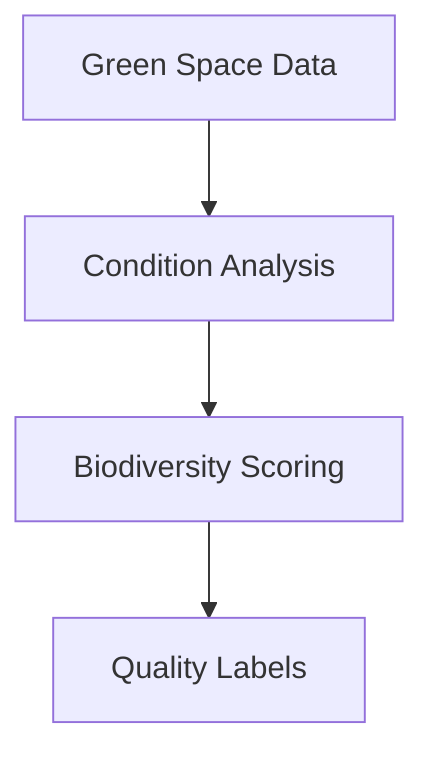

# Green Spaces Segmentation Module

## 🌳 Green Space Labels
### 🔍 Label Categories
- `#well_maintained`: maintenance_score > 8 (1-10 scale)
- `#needs_attention`: maintenance_score < 5 (1-10 scale)
- `#large_park`: area_sqm > 50,000
- `#biodiverse`: species_count > avg * 1.0
- `#has_playground`: 'playground' in facilities array
- `#spacious`: area_sqm > 20,000 (medium-sized spaces)
- `#green`: vegetation_coverage > 0.7 (70%+ vegetation)

### ⚙️ Implementation
| Label | Rule | Type | Data Source |
|-------|------|------|-------------|
| #well_maintained | maintenance_score > 8 | Static | City inspections |
| #needs_attention | maintenance_score < 5 | Static | Citizen reports |
| #large_park | area_sqm > 50,000 | Static | GIS data |
| #biodiverse | species_count > avg * 1.0 | Dynamic | Ecological surveys |
| #has_playground | 'playground' in facilities | Static | Amenities survey |

## 🛠 Implementation Details
### Data Processing
1. Pulls from `test_berlin_data.green_spaces`
2. Normalizes maintenance scores (1-10 scale)
3. Calculates biodiversity metrics
4. Processes facilities array
5. Calculates derived metrics

### Algorithms
- Maintenance condition analysis
- Ecological value assessment
- Amenities analysis



## 📊 Usage
```python
from green_spaces import GreenSpaceSegmenter
segmenter = GreenSpaceSegmenter()
results = segmenter.analyze(engine)
```

## ⚠️ Edge Cases
- Flags areas under renovation
- Adjusts for seasonal variations
- Handles missing ecological data