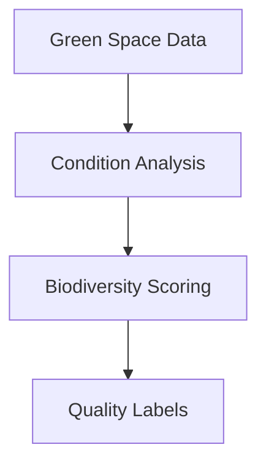

# Green Spaces Segmentation Module

## 🌳 Green Space Labels
### 🔍 Label Categories
- `#well_maintained`: maintenance_score > 8
- `#needs_attention`: maintenance_score < 5  
- `#large_park`: area > 50,000 sqm
- `#biodiverse`: species_count > avg * 1.5

### ⚙️ Implementation
| Label | Rule | Type | Data Source |
|-------|------|------|-------------|
| #well_maintained | maintenance_score > 8 | Static | City inspections |
| #needs_attention | maintenance_score < 5 | Static | Citizen reports |
| #large_park | area > 50,000 sqm | Static | GIS data |
| #biodiverse | species_count > avg * 1.5 | Dynamic | Ecological surveys |

## 🛠 Implementation Details
### Data Processing
1. Pulls from `test_berlin_data.green_spaces`
2. Normalizes maintenance scores
3. Calculates biodiversity metrics
4. Integrates with GIS mapping

### Algorithms
- Facility condition analysis
- Ecological value assessment
- Accessibility scoring



## 📊 Usage
```python
from green_spaces import GreenSpaceSegmenter
segmenter = GreenSpaceSegmenter()
results = segmenter.analyze(engine)
```

## ⚠️ Edge Cases
- Flags areas under renovation
- Adjusts for seasonal variations
- Handles missing ecological data