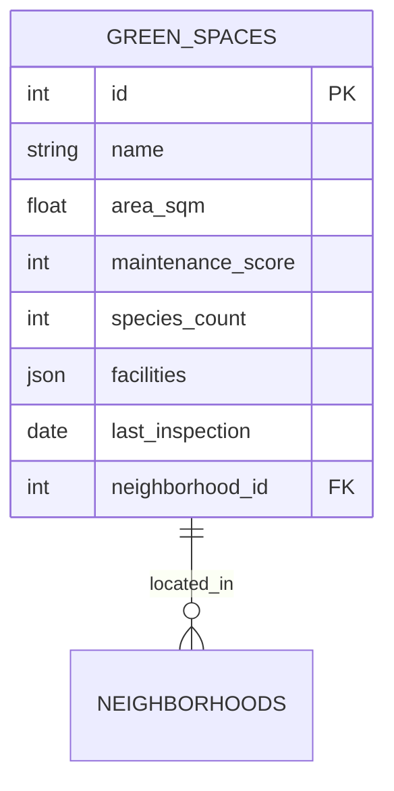

# Green Spaces Schema Documentation

## Database Tables
### `green_spaces`
- `id`: Primary key
- `name`: Park/garden name
- `area_sqm`: Size in square meters
- `maintenance_score`: 1-10 rating
- `species_count`: Number of plant species
- `facilities`: JSON array of amenities
- `last_inspection`: Date of last inspection
- `neighborhood_id`: Foreign key

## Data Relationships

## Field Descriptions
| Field | Type | Description | Example |
|-------|------|-------------|---------|
| maintenance_score | integer | 1-10 rating (10=best) | 8 |
| species_count | integer | Count of unique plant species | 42 |
| facilities | json | Available amenities | ["playground","toilets"] |

## Data Quality Notes
- Maintenance scores updated quarterly
- Species counts may be seasonal
- Area measurements rounded to nearest 100sqm