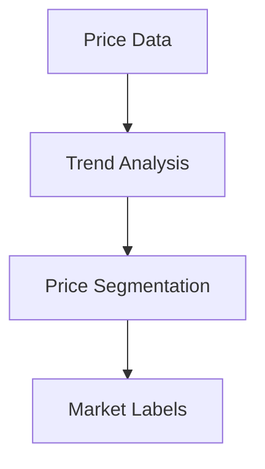

# Land Prices Segmentation Module

## 💰 Price Tier Labels
### 🔍 Label Categories
- `#luxury`: price_per_sqm > avg * 2
- `#mid_range`: price_per_sqm between avg*0.8-1.5
- `#affordable`: price_per_sqm < avg * 0.8
- `#rising`: yoy_growth > 0.1

### ⚙️ Implementation
| Label | Rule | Type | Data Source |
|-------|------|------|-------------|
| #luxury | price > city_avg * 2 | Dynamic | Property records |
| #rising | yoy_growth > 0.1 | Dynamic | Market indices |
| #affordable | price < city_avg * 0.8 | Dynamic | Tax assessments |

## 🛠 Implementation Details
### Data Processing
1. Pulls from `test_berlin_data.property_prices`
2. Uses 12-month smoothed averages
3. Adjusts for inflation
4. Excludes outlier transactions

### Algorithms
- Price distribution analysis
- Growth trend modeling
- Market segmentation



## 📊 Usage
```python
from land_prices import PriceSegmenter
segmenter = PriceSegmenter()
results = segmenter.analyze(engine)
```

## ⚠️ Edge Cases
- Flags areas with few transactions
- Adjusts for redevelopment zones
- Handles assessment delays