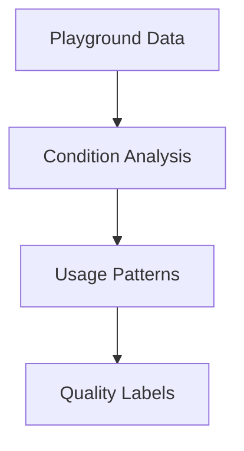

# Playgrounds Segmentation Module

## 🏗️ Infrastructure Labels
### 🔍 Label Categories
- `#well_maintained`: maintenance_score > 8
- `#needs_repair`: maintenance_score < 5
- `#high_capacity`: capacity > avg * 1.5
- `#modern`: built_after > 2010

### ⚙️ Implementation
| Label | Rule | Type | Data Source |
|-------|------|------|-------------|
| #well_maintained | maintenance_score > 8 | Static | City inspections |
| #needs_repair | maintenance_score < 5 | Static | Citizen reports |
| #high_capacity | capacity > avg * 1.5 | Dynamic | Usage data |
| #modern | built_after > 2010 | Static | Construction records |

## 🛠 Implementation Details
### Data Processing
1. Pulls from `test_berlin_data.playgrounds`
2. Normalizes maintenance scores
3. Calculates capacity metrics
4. Filters seasonal playgrounds

### Algorithms
- Facility condition analysis
- Usage pattern modeling
- Accessibility scoring



## 📊 Usage
```python
from playgrounds import PlaygroundSegmenter
segmenter = PlaygroundSegmenter()
results = segmenter.analyze(engine)
```

## ⚠️ Edge Cases
- Flags playgrounds under renovation
- Adjusts for seasonal closures
- Handles missing inspection data