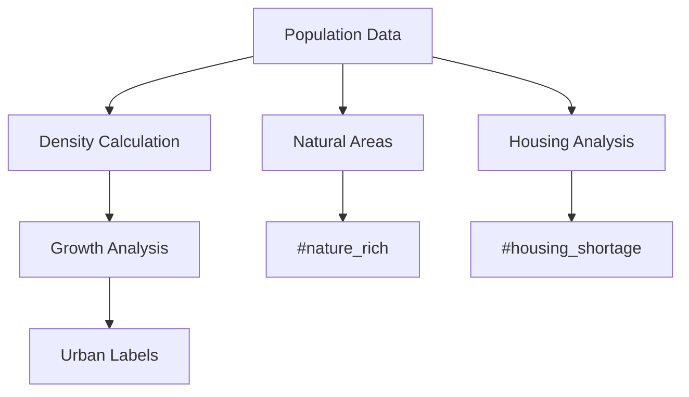

# Regional Statistics Segmentation Module

## 🏙️ Urban Profile Labels
### 🔍 Label Categories
- `#dense_urban`: population_density > avg * 1.5
- `#suburban`: density between avg*0.5-1.5  
- `#rural`: density < avg * 0.5
- `#growing`: pop_growth > avg * 1.2
- `#nature_rich`: share_forest_water_agriculture > 0.4
- `#spacious`: living_space_per_resident_m2 > avg * 1.3
- `#housing_shortage`: residences/inhabitants < 0.9

### ⚙️ Implementation
| Label | Rule | Type | Data Source |
|-------|------|------|-------------|
| #dense_urban | density > city_avg * 1.5 | Static | Census |
| #growing | pop_growth > city_avg * 1.2 | Dynamic | Population stats |
| #nature_rich | natural_areas > 40% | Static | GIS data |
| #spacious | living_space > avg*1.3 | Dynamic | Housing survey |
| #housing_shortage | residences/residents < 0.9 | Dynamic | Housing registry |

## 🛠 Implementation Details
### Data Processing
1. Pulls from `test_berlin_data.population`
2. Calculates density per neighborhood
3. Tracks 5-year growth trends  
4. Normalizes by land area
5. Computes natural area percentages
6. Analyzes housing ratios

### Algorithms
- Population density calculations
- Growth rate analysis
- Threshold-based classification
- Natural area assessment
- Housing adequacy scoring



## 📊 Usage
```python
from regional_statistics import RegionalSegmenter
segmenter = RegionalSegmenter()
results = segmenter.analyze(engine)
```

## ⚠️ Edge Cases
- Flags areas with boundary changes
- Adjusts for annexations
- Handles missing historical data
- Accounts for seasonal populations
- Adjusts for institutional housing