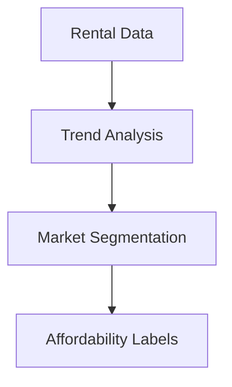

# Rent Statistics Segmentation Module

## 🏠 Rental Market Labels
### 🔍 Label Categories
- `#rising_rents`: yoy_increase > 0.1
- `#stable`: yoy_change between -0.05 and 0.05
- `#affordable`: rent_per_sqm < avg * 0.8
- `#luxury`: rent_per_sqm > avg * 1.5

### ⚙️ Implementation
| Label | Rule | Type | Data Source |
|-------|------|------|-------------|
| #rising_rents | yoy_increase > 0.1 | Dynamic | Rental registry |
| #stable | -0.05 < yoy_change < 0.05 | Dynamic | Market surveys |
| #affordable | rent < avg * 0.8 | Dynamic | Tenant reports |
| #luxury | rent > avg * 1.5 | Dynamic | Listing data |

## 🛠 Implementation Details
### Data Processing
1. Pulls from `test_berlin_data.rental_stats`
2. Uses 12-month rolling averages
3. Adjusts for apartment size
4. Normalizes by neighborhood

### Algorithms
- Rent trend analysis
- Market segmentation
- Affordability scoring



## 📊 Usage
```python
from rent_stats import RentSegmenter
segmenter = RentSegmenter()
results = segmenter.analyze(engine)
```

## ⚠️ Edge Cases
- Flags areas with few listings
- Adjusts for rent-controlled units
- Handles data reporting lags