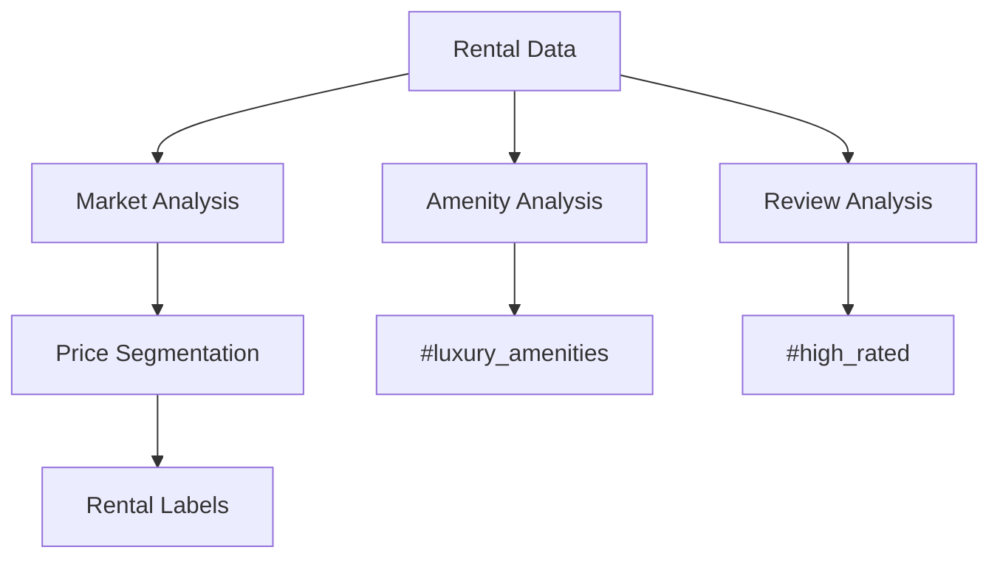

# Short-Term Rentals Segmentation Module

## 🏡 Rental Market Labels
### 🔍 Label Categories
- `#airbnb_hotspot`: listings > avg * 2
- `#balanced_market`: listings between avg*0.8-1.2  
- `#premium`: price > avg * 1.5
- `#affordable`: price < avg * 0.8
- `#high_rated`: review_scores_rating > 4.8
- `#family_friendly`: accommodates >=4 AND bedrooms >=2
- `#luxury_amenities`: amenities_count > 15 AND price > avg*2

### ⚙️ Implementation
| Label | Rule | Type | Data Source |
|-------|------|------|-------------|
| #airbnb_hotspot | listings > city_avg * 2 | Dynamic | Scraped data |
| #premium | price > city_avg * 1.5 | Dynamic | Listing prices |
| #affordable | price < city_avg * 0.8 | Dynamic | Market reports |
| #high_rated | rating > 4.8 AND reviews > 10 | Dynamic | Review data |
| #family_friendly | accommodates >=4 AND beds >=2 | Dynamic | Listing details |
| #luxury_amenities | amenities >15 AND price >avg*2 | Dynamic | Amenity lists |

## 🛠 Implementation Details
### Data Processing
1. Pulls from `test_berlin_data.short_rentals`
2. Normalizes by property type  
3. Calculates 30-day rolling averages
4. Excludes commercial listings
5. Analyzes amenity lists
6. Computes review metrics

### Algorithms
- Market density analysis
- Price distribution modeling
- Outlier detection
- Amenity scoring
- Review sentiment analysis



## 📊 Usage
```python
from short_time_listings import RentalSegmenter
segmenter = RentalSegmenter()
results = segmenter.analyze(engine)
```

## ⚠️ Edge Cases
- Flags new developments
- Adjusts for seasonal variations
- Handles data gaps during holidays
- Accounts for temporary price drops
- Identifies potentially illegal listings