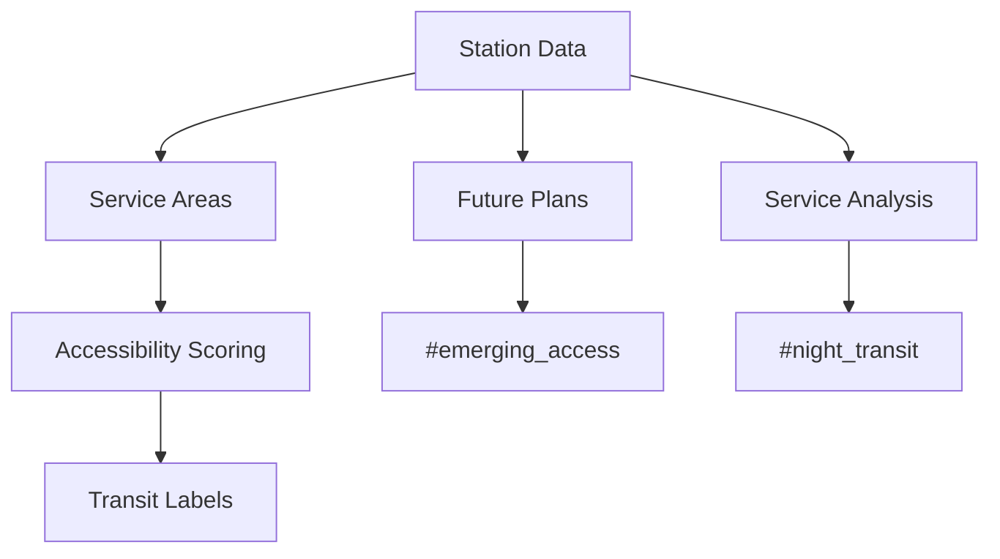

# U-Bahn Accessibility Segmentation Module

## 🚆 Transit Labels
### 🔍 Label Categories
- `#transit_hub`: station_count > avg * 1.5
- `#good_coverage`: station_count > avg  
- `#multi_line`: lines_served >= 3
- `#transit_desert`: station_count < avg * 0.5
- `#central_station`: line_count >= 4 AND district = "Mitte"
- `#emerging_access`: planned_stations > 1
- `#night_transit`: night_service = True

### ⚙️ Implementation
| Label | Rule | Type | Data Source |
|-------|------|------|-------------|
| #transit_hub | stations > city_avg * 1.5 | Static | Transit maps |
| #multi_line | lines >= 3 | Static | Network data |
| #transit_desert | stations < city_avg * 0.5 | Static | GIS data |
| #central_station | lines >=4 AND in_center | Static | Network maps |
| #emerging_access | planned_stations > 1 | Dynamic | City planning |
| #night_transit | night_service = True | Static | Schedule data |

## 🛠 Implementation Details
### Data Processing
1. Pulls from `test_berlin_data.transit_stations`
2. Calculates 500m service areas
3. Counts stations per neighborhood  
4. Identifies line intersections
5. Incorporates planned stations
6. Checks night service availability

### Algorithms
- Spatial buffering (500m radius)
- Network analysis
- Density calculations
- Future access modeling
- Service level evaluation



## 📊 Usage
```python
from ubahn import TransitSegmenter
segmenter = TransitSegmenter()
results = segmenter.analyze(engine)
```

## ⚠️ Edge Cases
- Flags areas with planned stations
- Adjusts for temporary closures
- Handles network expansions
- Accounts for service disruptions
- Tracks station accessibility features